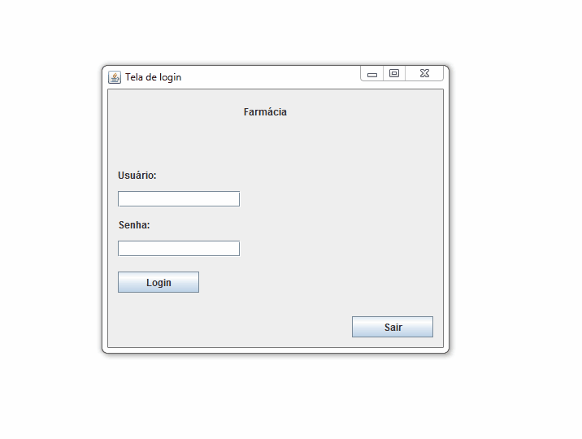
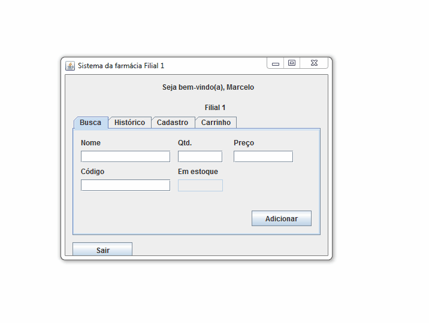

Trabalho Final da matéria de Algoritmos 3

O projeto se trata de uma farmácia, onde o usuário é o funcionário.

O funcionário pode:
  -Buscar um produto pelo seu nome ou ID
  -Ver o histórico de vendas de certo funcionário/histórico de compras de certo cliente
  -Realizar vendas com o carrinho de produtos (E inclusive remover algum produto)
  
Funcionalidades da farmácia:
  -O funcionário recebe comissão baseado em 1% do valor das suas vendas.
  -O cliente recebe descontos conforme sua fidelidade à farmácia (por quantidade de compras)

Tela de login - Tela do funcionario

Exemplo de compra (Do carrinho até a finalização)

